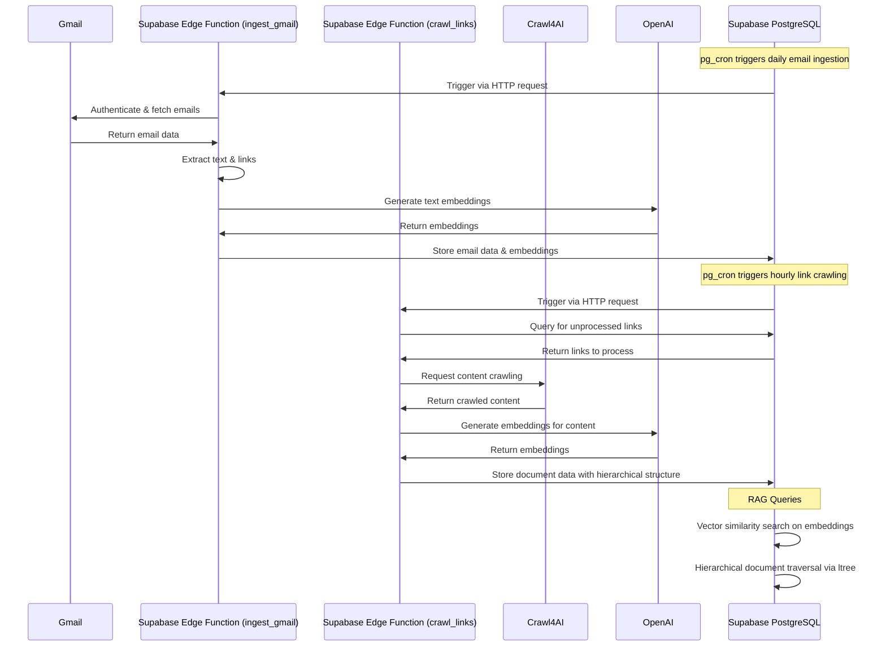

<div align="center">

# 📬 Supabase Vector Gmail KB RAG

### Deterministic & programmatic Gmail → Supabase → Crawl4AI vector knowledge base for Berkeley MIDS

[](https://opensource.org/licenses/MIT)


[](https://supabase.io/)


</div>

## 📋 Introduction

This repository provides a comprehensive, automated pipeline for ingesting emails from Gmail, extracting and crawling links, and creating a vector-based knowledge base using Supabase, pgvector, and Edge Functions. The system is designed specifically for Berkeley MIDS (Master of Information and Data Science) program, enabling efficient retrieval and querying of email content and linked documents using Retrieval-Augmented Generation (RAG) techniques.

## ✨ Key Features

- **Programmatic Gmail Integration**: Automatically ingest emails with metadata, content extraction, and link identification
- **Hierarchical Document Crawling**: Extract and process linked documents with hierarchical relationships using PostgreSQL's ltree extension
- **Vector-Based Similarity Search**: Generate and store embeddings for both emails and documents using OpenAI's text-embedding models via pgvector
- **Fully Scheduled Pipeline**: Automated daily email ingestion and hourly link crawling via pg_cron
- **Edge Function Architecture**: Serverless processing using Supabase Edge Functions built on Deno 1.40
- **Crawl4AI Integration**: High-performance web crawling designed specifically for AI document processing
- **Comprehensive Metadata**: Store and index sender information, timestamps, subjects, and more for advanced filtering

## 🛠️ Tech Stack

<table>
  <tr>
    <td align="center"><br/>Supabase</td>
    <td align="center"><br/>pgvector</td>
    <td align="center"><br/>Crawl4AI</td>
  </tr>
  <tr>
    <td align="center"><br/>OpenAI</td>
    <td align="center"><br/>Deno</td>
    <td align="center"><br/>Gmail API</td>
  </tr>
</table>

## 🔄 Architecture Diagram



For a more detailed architecture explanation, see [ARCHITECTURE.md](docs/ARCHITECTURE.md).

## 🚀 Getting Started

### Prerequisites

- Supabase account and project
- Gmail API credentials (Client ID, Client Secret, Refresh Token)
- OpenAI API key
- Crawl4AI API key
- Deno 1.40+ (for local Edge Function development)

### Installation

1. Clone the repository:

```bash
git clone https://github.com/bjornmelin/supabase-vector-gmailkb-rag.git
cd supabase-vector-gmailkb-rag
```

2. Set up environment variables:

```bash
cp .env.example .env
# Edit .env with your credentials
```

3. Apply the database migrations:

```bash
# Apply base schema
supabase db push schema/schema.sql

# Apply ltree extension and hierarchical structures
supabase db push supabase/migrations/20250427_add_link_hierarchy.sql

# Set up scheduled jobs
supabase db push supabase/migrations/20250427_edge_functions.sql
```

4. Deploy Edge Functions:

```bash
supabase functions deploy ingest_gmail
supabase functions deploy crawl_links
```

5. Set up secrets for Edge Functions:

```bash
supabase secrets set OPENAI_API_KEY=your-api-key
supabase secrets set GMAIL_CLIENT_ID=your-client-id
supabase secrets set GMAIL_CLIENT_SECRET=your-client-secret
supabase secrets set GMAIL_REFRESH_TOKEN=your-refresh-token
supabase secrets set CRAWL4AI_API_KEY=your-api-key
```

### Usage

#### Running Locally

For local development and testing:

```bash
# Test Gmail ingestion with a specific time range
supabase functions serve ingest_gmail --env-file .env
curl -X POST http://localhost:54321/functions/v1/ingest_gmail \
  -H "Content-Type: application/json" \
  -H "Authorization: Bearer YOUR_ANON_KEY" \
  -d '{"since_hours": 24}'

# Test link crawling with specific parameters
supabase functions serve crawl_links --env-file .env
curl -X POST http://localhost:54321/functions/v1/crawl_links \
  -H "Content-Type: application/json" \
  -H "Authorization: Bearer YOUR_ANON_KEY" \
  -d '{"max_links": 10, "older_than_minutes": 60}'
```

#### Managing Cron Jobs

To view, create, or modify scheduled jobs:

```sql
-- View all scheduled jobs
SELECT * FROM cron.job;

-- Disable a job
SELECT cron.unschedule('job_name');

-- Update job schedule
SELECT cron.schedule(
  'daily-email-ingest',
  '0 3 * * *', -- Changed to 3 AM every day
  $$
  SELECT
    supabase_edge.http_request(
      'POST',
      (SELECT value FROM supabase_edge.config WHERE name = 'EDGE_FUNCTION_BASE_URL') || '/ingest_gmail',
      '{"since_hours": 24}',
      'application/json',
      60000
    );
  $$
);
```

#### Database Maintenance

To maintain optimal performance:

```sql
-- Reindex vector indexes (run monthly)
REINDEX INDEX emails_embedding_idx;
REINDEX INDEX link_docs_embedding_idx;

-- Vacuum analyze for statistics update (run weekly)
VACUUM ANALYZE emails;
VACUUM ANALYZE link_docs;
```

## 🤝 Contributing

Contributions are welcome! Please feel free to submit a Pull Request.

1. Fork the repository
2. Create your feature branch (`git checkout -b feature/amazing-feature`)
3. Commit your changes (`git commit -m 'Add some amazing feature'`)
4. Push to the branch (`git push origin feature/amazing-feature`)
5. Open a Pull Request

Please ensure your code follows the existing style and includes appropriate tests.

## 📄 License

This project is licensed under the MIT License - see the [LICENSE](LICENSE) file for details.

## 📚 How to Cite

If you use this project in your research or work, please cite it as:

```bibtex
@software{melin2025supabasevector,
  author = {Melin, Bjorn},
  title = {Supabase Vector Gmail KB RAG},
  year = {2025},
  url = {https://github.com/bjornmelin/supabase-vector-gmailkb-rag}
}
```

## 🙏 Acknowledgments

- [Supabase](https://supabase.io/) for their excellent PostgreSQL platform and pgvector integration
- [Crawl4AI](https://github.com/unclecode/crawl4ai) for their high-performance crawling solution
- [OpenAI](https://openai.com/) for their embedding models
- [Berkeley MIDS Program](https://ischoolonline.berkeley.edu/data-science/) for inspiring this project
