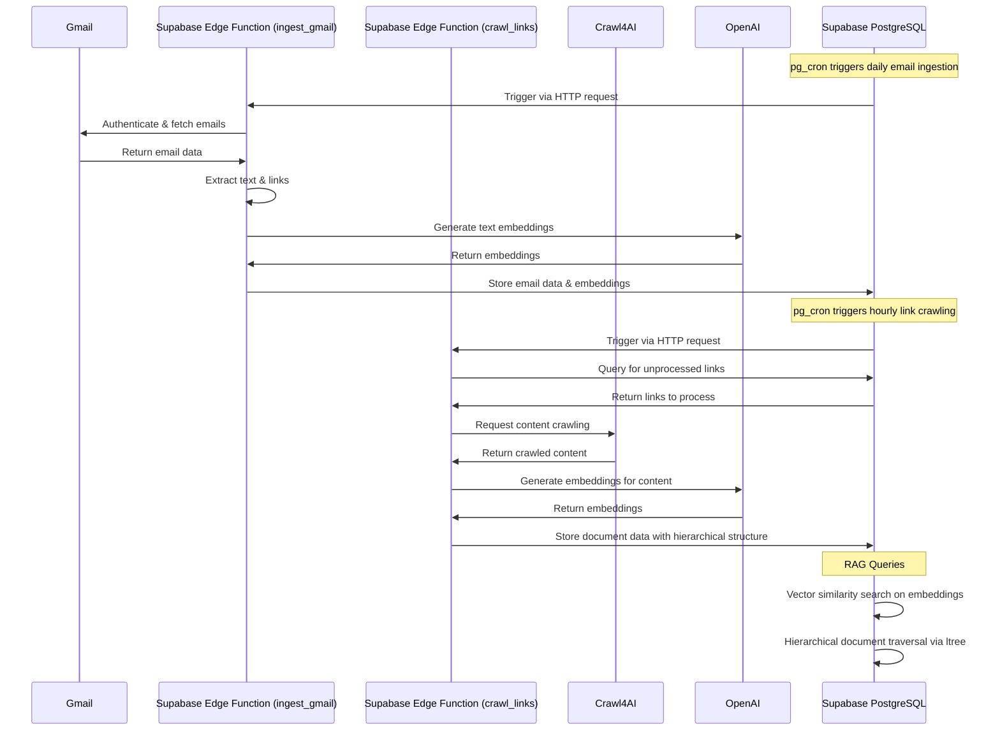

# 🏗️ Architecture Overview

This document provides a comprehensive explanation of the system architecture for the `supabase-vector-gmailkb-rag` project, detailing how data flows from Gmail through Supabase to create a searchable knowledge base with vector embeddings.

## System Components

### 1. Database Schema

The system relies on three primary tables in Supabase PostgreSQL:

#### `emails` Table

```sql
create table emails(
  email_id uuid primary key,
  from_addr text,
  to_addr text[],
  subject text,
  received_at timestamptz,
  labels text[],
  clean_text text,
  links text[],
  embedding vector(1536)
);
```

This table stores:
- Email metadata (sender, recipients, subject, timestamps, labels)
- Cleaned text content of emails
- Extracted links for further crawling
- Vector embeddings (1536-dimensional) generated from the email content

#### `link_docs` Table

```sql
create table link_docs(
  link_id uuid primary key,
  email_id uuid references emails(email_id),
  url text,
  mime_type text,
  title text,
  content text,
  embedding vector(1536),
  parent_link_id uuid references link_docs(link_id),
  path ltree
);
```

This table stores:
- Content crawled from links found in emails
- Reference to the source email
- Hierarchical structure using parent references and ltree paths
- Vector embeddings of the document content

#### `tasks` Table

```sql
create table tasks(
  task_id uuid primary key,
  email_id uuid references emails(email_id),
  link_id uuid references link_docs(link_id),
  task text,
  status text default 'todo',
  priority int2 default 3,
  due_date date,
  created_at timestamptz default now()
);
```

This table stores tasks extracted from emails and linked documents, enabling action item tracking.

### 2. Vector Storage with pgvector

The system leverages PostgreSQL's pgvector extension for efficient similarity search:

```sql
create index on emails using ivfflat (embedding vector_l2_ops) with (lists=100);
create index on link_docs using ivfflat (embedding vector_l2_ops) with (lists=100);
```

These indexes enable:
- Fast nearest-neighbor search across large vector collections
- Optimized performance with IVF (Inverted File) indexing
- L2 distance calculations for similarity metrics

### 3. Hierarchical Document Structure with ltree

The system uses PostgreSQL's ltree extension to represent hierarchical relationships between documents:

```sql
-- Install ltree extension
CREATE EXTENSION IF NOT EXISTS ltree;

-- Add path column to link_docs table
ALTER TABLE link_docs ADD COLUMN IF NOT EXISTS path ltree;

-- Create index on path column for efficient hierarchical queries
CREATE INDEX link_docs_path_idx ON link_docs USING GIST (path);
```

This enables:
- Efficient path-based queries (ancestors, descendants, etc.)
- Hierarchical document organization
- Fast tree traversal operations

### 4. Edge Functions (Deno 1.40)

The system uses Supabase Edge Functions (built on Deno 1.40) for serverless processing:

#### `ingest_gmail.ts`

This function:
1. Authenticates with Gmail API
2. Fetches new emails based on time filters
3. Extracts text content and links
4. Generates embeddings via OpenAI API
5. Stores processed emails in the `emails` table

#### `crawl_links.ts`

This function:
1. Retrieves unprocessed links from the `emails` table
2. Uses Crawl4AI to fetch and process content from each link
3. Generates embeddings for the content
4. Stores documents in the `link_docs` table with hierarchical structure
5. Recursively processes child links with proper parent-child relationships

### 5. Scheduled Automation with pg_cron

The system uses PostgreSQL's pg_cron extension for scheduled operations:

```sql
-- Enable pg_cron extension
CREATE EXTENSION IF NOT EXISTS pg_cron;

-- Create pg_cron schedule for daily email processing
SELECT cron.schedule(
  'daily-email-ingest',
  '0 1 * * *', -- Run at 1 AM every day
  $$
  SELECT
    supabase_edge.http_request(
      'POST',
      (SELECT value FROM supabase_edge.config WHERE name = 'EDGE_FUNCTION_BASE_URL') || '/ingest_gmail',
      '{"since_hours": 24}',
      'application/json',
      60000
    );
  $$
);

-- Create pg_cron schedule for link crawling
SELECT cron.schedule(
  'hourly-link-crawl',
  '30 * * * *', -- Run at 30 minutes past every hour
  $$
  SELECT
    supabase_edge.http_request(
      'POST',
      (SELECT value FROM supabase_edge.config WHERE name = 'EDGE_FUNCTION_BASE_URL') || '/crawl_links',
      '{"max_links": 50, "older_than_minutes": 60}',
      'application/json',
      180000
    );
  $$
);
```

This enables:
- Automated daily email ingestion
- Hourly link crawling and processing
- Configurable scheduling with cron syntax

## Data Flow



## Performance Considerations

1. **Vector Indexing**: The IVFFLAT indexes with 100 lists provide a balance between search speed and accuracy for the 1536-dimensional vectors.

2. **Batch Processing**: The `crawl_links` function processes a configurable batch size (default: 50 links) per run to prevent resource exhaustion.

3. **Rate Limiting**: Both Edge Functions implement retry mechanisms and rate limiting to handle API quotas for Gmail, OpenAI, and Crawl4AI.

4. **Recursive Depth Control**: Link crawling depth is configurable to prevent excessive resource usage.

5. **Text Truncation**: Email and document content is truncated to 8,191 tokens before embedding to comply with OpenAI API limits.

## Security Considerations

1. **Service Roles**: Edge Functions use service role keys with appropriate security policies.

2. **Environment Variables**: All sensitive credentials are stored as environment variables.

3. **Data Validation**: Input validation is performed on all user-supplied parameters.

4. **Error Handling**: Comprehensive error handling prevents system crashes and information leakage.
