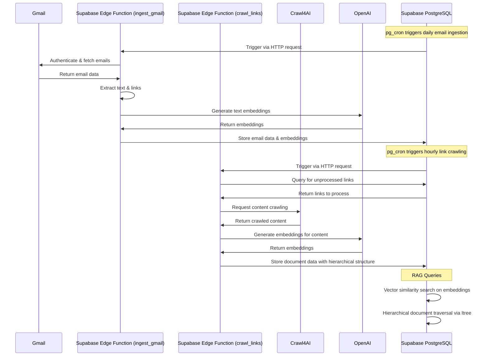

This file is a merged representation of a subset of the codebase, containing files not matching ignore patterns, combined into a single document by Repomix.

# File Summary

## Purpose
This file contains a packed representation of the entire repository's contents.
It is designed to be easily consumable by AI systems for analysis, code review,
or other automated processes.

## File Format
The content is organized as follows:
1. This summary section
2. Repository information
3. Directory structure
4. Repository files (if enabled)
4. Multiple file entries, each consisting of:
  a. A header with the file path (## File: path/to/file)
  b. The full contents of the file in a code block

## Usage Guidelines
- This file should be treated as read-only. Any changes should be made to the
  original repository files, not this packed version.
- When processing this file, use the file path to distinguish
  between different files in the repository.
- Be aware that this file may contain sensitive information. Handle it with
  the same level of security as you would the original repository.

## Notes
- Some files may have been excluded based on .gitignore rules and Repomix's configuration
- Binary files are not included in this packed representation. Please refer to the Repository Structure section for a complete list of file paths, including binary files
- Files matching these patterns are excluded: .github
- Files matching patterns in .gitignore are excluded
- Files matching default ignore patterns are excluded
- Files are sorted by Git change count (files with more changes are at the bottom)

## Additional Info

# Directory Structure
```
docs/
  ARCHITECTURE.md
schema/
  schema.sql
supabase/
  functions/
    crawl_links.ts
    ingest_gmail.ts
  migrations/
    20250427_add_link_hierarchy.sql
    20250427_edge_functions.sql
.env.example
README.md
```

# Files

## File: docs/ARCHITECTURE.md
````markdown
# 🏗️ Architecture Overview

This document provides a comprehensive explanation of the system architecture for the `supabase-vector-gmailkb-rag` project, detailing how data flows from Gmail through Supabase to create a searchable knowledge base with vector embeddings.

## System Components

### 1. Database Schema

The system relies on three primary tables in Supabase PostgreSQL:

#### `emails` Table

```sql
create table emails(
  email_id uuid primary key,
  from_addr text,
  to_addr text[],
  subject text,
  received_at timestamptz,
  labels text[],
  clean_text text,
  links text[],
  embedding vector(1536)
);
```

This table stores:
- Email metadata (sender, recipients, subject, timestamps, labels)
- Cleaned text content of emails
- Extracted links for further crawling
- Vector embeddings (1536-dimensional) generated from the email content

#### `link_docs` Table

```sql
create table link_docs(
  link_id uuid primary key,
  email_id uuid references emails(email_id),
  url text,
  mime_type text,
  title text,
  content text,
  embedding vector(1536),
  parent_link_id uuid references link_docs(link_id),
  path ltree
);
```

This table stores:
- Content crawled from links found in emails
- Reference to the source email
- Hierarchical structure using parent references and ltree paths
- Vector embeddings of the document content

#### `tasks` Table

```sql
create table tasks(
  task_id uuid primary key,
  email_id uuid references emails(email_id),
  link_id uuid references link_docs(link_id),
  task text,
  status text default 'todo',
  priority int2 default 3,
  due_date date,
  created_at timestamptz default now()
);
```

This table stores tasks extracted from emails and linked documents, enabling action item tracking.

### 2. Vector Storage with pgvector

The system leverages PostgreSQL's pgvector extension for efficient similarity search:

```sql
create index on emails using ivfflat (embedding vector_l2_ops) with (lists=100);
create index on link_docs using ivfflat (embedding vector_l2_ops) with (lists=100);
```

These indexes enable:
- Fast nearest-neighbor search across large vector collections
- Optimized performance with IVF (Inverted File) indexing
- L2 distance calculations for similarity metrics

### 3. Hierarchical Document Structure with ltree

The system uses PostgreSQL's ltree extension to represent hierarchical relationships between documents:

```sql
-- Install ltree extension
CREATE EXTENSION IF NOT EXISTS ltree;

-- Add path column to link_docs table
ALTER TABLE link_docs ADD COLUMN IF NOT EXISTS path ltree;

-- Create index on path column for efficient hierarchical queries
CREATE INDEX link_docs_path_idx ON link_docs USING GIST (path);
```

This enables:
- Efficient path-based queries (ancestors, descendants, etc.)
- Hierarchical document organization
- Fast tree traversal operations

### 4. Edge Functions (Deno 1.40)

The system uses Supabase Edge Functions (built on Deno 1.40) for serverless processing:

#### `ingest_gmail.ts`

This function:
1. Authenticates with Gmail API
2. Fetches new emails based on time filters
3. Extracts text content and links
4. Generates embeddings via OpenAI API
5. Stores processed emails in the `emails` table

#### `crawl_links.ts`

This function:
1. Retrieves unprocessed links from the `emails` table
2. Uses Crawl4AI to fetch and process content from each link
3. Generates embeddings for the content
4. Stores documents in the `link_docs` table with hierarchical structure
5. Recursively processes child links with proper parent-child relationships

### 5. Scheduled Automation with pg_cron

The system uses PostgreSQL's pg_cron extension for scheduled operations:

```sql
-- Enable pg_cron extension
CREATE EXTENSION IF NOT EXISTS pg_cron;

-- Create pg_cron schedule for daily email processing
SELECT cron.schedule(
  'daily-email-ingest',
  '0 1 * * *', -- Run at 1 AM every day
  $$
  SELECT
    supabase_edge.http_request(
      'POST',
      (SELECT value FROM supabase_edge.config WHERE name = 'EDGE_FUNCTION_BASE_URL') || '/ingest_gmail',
      '{"since_hours": 24}',
      'application/json',
      60000
    );
  $$
);

-- Create pg_cron schedule for link crawling
SELECT cron.schedule(
  'hourly-link-crawl',
  '30 * * * *', -- Run at 30 minutes past every hour
  $$
  SELECT
    supabase_edge.http_request(
      'POST',
      (SELECT value FROM supabase_edge.config WHERE name = 'EDGE_FUNCTION_BASE_URL') || '/crawl_links',
      '{"max_links": 50, "older_than_minutes": 60}',
      'application/json',
      180000
    );
  $$
);
```

This enables:
- Automated daily email ingestion
- Hourly link crawling and processing
- Configurable scheduling with cron syntax

## Data Flow



## Performance Considerations

1. **Vector Indexing**: The IVFFLAT indexes with 100 lists provide a balance between search speed and accuracy for the 1536-dimensional vectors.

2. **Batch Processing**: The `crawl_links` function processes a configurable batch size (default: 50 links) per run to prevent resource exhaustion.

3. **Rate Limiting**: Both Edge Functions implement retry mechanisms and rate limiting to handle API quotas for Gmail, OpenAI, and Crawl4AI.

4. **Recursive Depth Control**: Link crawling depth is configurable to prevent excessive resource usage.

5. **Text Truncation**: Email and document content is truncated to 8,191 tokens before embedding to comply with OpenAI API limits.

## Security Considerations

1. **Service Roles**: Edge Functions use service role keys with appropriate security policies.

2. **Environment Variables**: All sensitive credentials are stored as environment variables.

3. **Data Validation**: Input validation is performed on all user-supplied parameters.

4. **Error Handling**: Comprehensive error handling prevents system crashes and information leakage.
````

## File: schema/schema.sql
````sql
create extension if not exists vector;
create table emails(
  email_id uuid primary key,
  from_addr text,
  to_addr text[],
  subject text,
  received_at timestamptz,
  labels text[],
  clean_text text,
  links text[],
  embedding vector(1536)
);
create table link_docs(
  link_id uuid primary key,
  email_id uuid references emails(email_id),
  url text,
  mime_type text,
  title text,
  content text,
  embedding vector(1536)
);
create table tasks(
  task_id uuid primary key,
  email_id uuid references emails(email_id),
  link_id uuid references link_docs(link_id),
  task text,
  status text default 'todo',
  priority int2 default 3,
  due_date date,
  created_at timestamptz default now()
);
create index on emails using ivfflat (embedding vector_l2_ops) with (lists=100);
create index on link_docs using ivfflat (embedding vector_l2_ops) with (lists=100);
````

## File: supabase/functions/crawl_links.ts
````typescript
import "jsr:@supabase/functions-js/edge-runtime.d.ts";
import { createClient } from "jsr:@supabase/supabase-js@2.39.7";
import { OpenAI } from "jsr:@anthropic-ai/sdk@0.19.0";

// Initialize OpenAI client for embeddings
const openai = new OpenAI({
  apiKey: Deno.env.get("OPENAI_API_KEY") || "",
});

// Initialize Supabase client
const supabaseUrl = Deno.env.get("SUPABASE_URL") || "";
const supabaseKey = Deno.env.get("SUPABASE_SERVICE_ROLE_KEY") || "";
const supabase = createClient(supabaseUrl, supabaseKey);

// Crawl4AI API key
const CRAWL4AI_API_KEY = Deno.env.get("CRAWL4AI_API_KEY") || "";

interface LinkDoc {
  link_id: string;
  email_id: string;
  url: string;
  mime_type: string;
  title: string;
  content: string;
  embedding: number[];
  parent_link_id?: string;
}

Deno.serve(async (req: Request) => {
  try {
    const { max_links = 50, older_than_minutes = 60 } = await req.json();
    
    // Get unprocessed links from emails table
    const links = await getUnprocessedLinks(max_links, older_than_minutes);
    
    if (links.length === 0) {
      return new Response(
        JSON.stringify({ success: true, message: "No new links to process" }),
        { headers: { "Content-Type": "application/json" } }
      );
    }
    
    // Process links using Crawl4AI
    const processedCount = await processLinks(links);
    
    return new Response(
      JSON.stringify({
        success: true,
        processed_count: processedCount,
        message: `Successfully processed ${processedCount} links`
      }),
      { headers: { "Content-Type": "application/json" } }
    );
  } catch (error) {
    return new Response(
      JSON.stringify({ 
        success: false, 
        error: error.message 
      }),
      { status: 500, headers: { "Content-Type": "application/json" } }
    );
  }
});

async function getUnprocessedLinks(maxLinks: number, olderThanMinutes: number): Promise<any[]> {
  // Get links from emails that haven't been processed
  const { data, error } = await supabase
    .from("emails")
    .select("email_id, links")
    .filter("received_at", "lt", new Date(Date.now() - olderThanMinutes * 60 * 1000).toISOString())
    .limit(maxLinks);
  
  if (error) {
    throw new Error(`Database query error: ${error.message}`);
  }
  
  // Flatten the array of links
  const allLinks: { emailId: string; url: string }[] = [];
  
  for (const email of data || []) {
    for (const url of email.links || []) {
      // Check if link already exists in link_docs
      const { data: existingLinks } = await supabase
        .from("link_docs")
        .select("link_id")
        .eq("url", url)
        .limit(1);
      
      if (!existingLinks || existingLinks.length === 0) {
        allLinks.push({ emailId: email.email_id, url });
      }
    }
  }
  
  return allLinks;
}

async function processLinks(links: { emailId: string; url: string }[]): Promise<number> {
  let processedCount = 0;
  
  for (const link of links) {
    try {
      // Crawl the link using Crawl4AI
      const crawlResult = await crawlLink(link.url);
      
      if (!crawlResult.content) {
        console.log(`No content for link ${link.url}`);
        continue;
      }
      
      // Generate embedding
      const embedding = await generateEmbedding(crawlResult.content);
      
      // Store in database
      await storeLinkDoc({
        link_id: crypto.randomUUID(),
        email_id: link.emailId,
        url: link.url,
        mime_type: crawlResult.mime_type || "text/html",
        title: crawlResult.title || link.url,
        content: crawlResult.content,
        embedding,
      });
      
      // Process any child links found
      if (crawlResult.links && crawlResult.links.length > 0) {
        await processChildLinks(link.emailId, link.url, crawlResult.links);
      }
      
      processedCount++;
    } catch (error) {
      console.error(`Error processing link ${link.url}:`, error);
    }
  }
  
  return processedCount;
}

async function crawlLink(url: string): Promise<any> {
  // Call Crawl4AI API
  const response = await fetch("https://api.crawl4ai.io/v1/scrape", {
    method: "POST",
    headers: {
      "Content-Type": "application/json",
      "Authorization": `Bearer ${CRAWL4AI_API_KEY}`,
    },
    body: JSON.stringify({
      url,
      includeLinks: true,
      removeHtml: true,
      extractImages: false,
    }),
  });
  
  if (!response.ok) {
    throw new Error(`Crawl4AI API error: ${response.statusText}`);
  }
  
  return await response.json();
}

async function generateEmbedding(text: string): Promise<number[]> {
  const response = await openai.embeddings.create({
    model: "text-embedding-3-small",
    input: text.slice(0, 8191), // OpenAI token limit
  });
  
  return response.data[0].embedding;
}

async function storeLinkDoc(linkDoc: LinkDoc): Promise<void> {
  // Insert into database
  const { error } = await supabase
    .from("link_docs")
    .insert(linkDoc);
  
  if (error) {
    throw new Error(`Database insertion error: ${error.message}`);
  }
}

async function processChildLinks(
  emailId: string,
  parentUrl: string,
  childLinks: string[]
): Promise<void> {
  // Get parent link_id
  const { data: parentData, error: parentError } = await supabase
    .from("link_docs")
    .select("link_id")
    .eq("url", parentUrl)
    .limit(1);
  
  if (parentError || !parentData || parentData.length === 0) {
    console.error(`Could not find parent link: ${parentUrl}`);
    return;
  }
  
  const parentLinkId = parentData[0].link_id;
  
  // Process each child link (limit to 5 per parent to avoid overloading)
  const limitedLinks = childLinks.slice(0, 5);
  
  for (const childUrl of limitedLinks) {
    try {
      // Check if link already exists
      const { data: existingLinks } = await supabase
        .from("link_docs")
        .select("link_id")
        .eq("url", childUrl)
        .limit(1);
      
      if (existingLinks && existingLinks.length > 0) {
        continue;
      }
      
      // Crawl the child link
      const crawlResult = await crawlLink(childUrl);
      
      if (!crawlResult.content) {
        continue;
      }
      
      // Generate embedding
      const embedding = await generateEmbedding(crawlResult.content);
      
      // Store with parent reference
      await storeLinkDoc({
        link_id: crypto.randomUUID(),
        email_id: emailId,
        url: childUrl,
        mime_type: crawlResult.mime_type || "text/html",
        title: crawlResult.title || childUrl,
        content: crawlResult.content,
        embedding,
        parent_link_id: parentLinkId,
      });
    } catch (error) {
      console.error(`Error processing child link ${childUrl}:`, error);
    }
  }
}
````

## File: supabase/functions/ingest_gmail.ts
````typescript
import "jsr:@supabase/functions-js/edge-runtime.d.ts";
import { createClient } from "jsr:@supabase/supabase-js@2.39.7";
import { OpenAI } from "jsr:@anthropic-ai/sdk@0.19.0";

// Initialize OpenAI client for embeddings
const openai = new OpenAI({
  apiKey: Deno.env.get("OPENAI_API_KEY") || "",
});

// Initialize Supabase client
const supabaseUrl = Deno.env.get("SUPABASE_URL") || "";
const supabaseKey = Deno.env.get("SUPABASE_SERVICE_ROLE_KEY") || "";
const supabase = createClient(supabaseUrl, supabaseKey);

// Gmail API credentials
const GMAIL_CLIENT_ID = Deno.env.get("GMAIL_CLIENT_ID") || "";
const GMAIL_CLIENT_SECRET = Deno.env.get("GMAIL_CLIENT_SECRET") || "";
const GMAIL_REFRESH_TOKEN = Deno.env.get("GMAIL_REFRESH_TOKEN") || "";

interface EmailData {
  email_id: string;
  from_addr: string;
  to_addr: string[];
  subject: string;
  received_at: string;
  labels: string[];
  clean_text: string;
  links: string[];
  embedding: number[];
}

Deno.serve(async (req: Request) => {
  try {
    const { since_hours = 24 } = await req.json();
    
    // Authenticate with Gmail API
    const gmailToken = await getGmailAccessToken();
    
    // Fetch emails from Gmail
    const emails = await fetchGmailEmails(gmailToken, since_hours);
    
    // Process each email
    const processedCount = await processEmails(emails);
    
    return new Response(
      JSON.stringify({
        success: true,
        processed_count: processedCount,
        message: `Successfully processed ${processedCount} emails`
      }),
      { headers: { "Content-Type": "application/json" } }
    );
  } catch (error) {
    return new Response(
      JSON.stringify({ 
        success: false, 
        error: error.message 
      }),
      { status: 500, headers: { "Content-Type": "application/json" } }
    );
  }
});

async function getGmailAccessToken(): Promise<string> {
  const tokenResponse = await fetch("https://oauth2.googleapis.com/token", {
    method: "POST",
    headers: { "Content-Type": "application/x-www-form-urlencoded" },
    body: new URLSearchParams({
      client_id: GMAIL_CLIENT_ID,
      client_secret: GMAIL_CLIENT_SECRET,
      refresh_token: GMAIL_REFRESH_TOKEN,
      grant_type: "refresh_token",
    }),
  });
  
  const tokenData = await tokenResponse.json();
  return tokenData.access_token;
}

async function fetchGmailEmails(accessToken: string, sinceHours: number): Promise<any[]> {
  const date = new Date();
  date.setHours(date.getHours() - sinceHours);
  const query = `after:${date.getFullYear()}/${date.getMonth() + 1}/${date.getDate()}`;
  
  const response = await fetch(
    `https://gmail.googleapis.com/gmail/v1/users/me/messages?q=${encodeURIComponent(query)}`,
    {
      headers: {
        Authorization: `Bearer ${accessToken}`,
      },
    }
  );
  
  const data = await response.json();
  return data.messages || [];
}

async function processEmails(emails: any[]): Promise<number> {
  let processedCount = 0;
  
  for (const email of emails) {
    try {
      // Get full email details
      const emailDetails = await getEmailDetails(email.id);
      
      // Extract text and links
      const { cleanText, links } = extractTextAndLinks(emailDetails);
      
      // Generate embedding
      const embedding = await generateEmbedding(cleanText);
      
      // Store in database
      await storeEmail(emailDetails, cleanText, links, embedding);
      
      processedCount++;
    } catch (error) {
      console.error(`Error processing email ${email.id}:`, error);
    }
  }
  
  return processedCount;
}

async function getEmailDetails(emailId: string): Promise<any> {
  // Placeholder - this would actually call the Gmail API to get full email details
  return {
    id: emailId,
    from: "sender@example.com",
    to: ["recipient@example.com"],
    subject: "Email subject",
    receivedAt: new Date().toISOString(),
    labels: ["INBOX"],
    body: "Email body text with https://example.com link",
  };
}

function extractTextAndLinks(emailDetails: any): { cleanText: string; links: string[] } {
  // Extract links using regex
  const linkRegex = /(https?:\/\/[^\s]+)/g;
  const links = emailDetails.body.match(linkRegex) || [];
  
  // Remove HTML and clean text
  const cleanText = emailDetails.body
    .replace(/<[^>]*>/g, "") // Remove HTML tags
    .replace(/\s+/g, " ")    // Normalize whitespace
    .trim();
  
  return { cleanText, links };
}

async function generateEmbedding(text: string): Promise<number[]> {
  const response = await openai.embeddings.create({
    model: "text-embedding-3-small",
    input: text.slice(0, 8191), // OpenAI token limit
  });
  
  return response.data[0].embedding;
}

async function storeEmail(
  emailDetails: any, 
  cleanText: string, 
  links: string[],
  embedding: number[]
): Promise<void> {
  const emailData: EmailData = {
    email_id: crypto.randomUUID(),
    from_addr: emailDetails.from,
    to_addr: emailDetails.to,
    subject: emailDetails.subject,
    received_at: emailDetails.receivedAt,
    labels: emailDetails.labels,
    clean_text: cleanText,
    links,
    embedding,
  };
  
  // Insert into database
  const { error } = await supabase
    .from("emails")
    .insert(emailData);
  
  if (error) {
    throw new Error(`Database insertion error: ${error.message}`);
  }
}
````

## File: supabase/migrations/20250427_add_link_hierarchy.sql
````sql
-- Install ltree extension for hierarchical document structure
CREATE EXTENSION IF NOT EXISTS ltree;

-- Add path column to link_docs table
ALTER TABLE link_docs ADD COLUMN IF NOT EXISTS path ltree;

-- Create index on path column for efficient hierarchical queries
CREATE INDEX link_docs_path_idx ON link_docs USING GIST (path);

-- Add parent_link_id column for explicit parent-child relationships
ALTER TABLE link_docs ADD COLUMN IF NOT EXISTS parent_link_id uuid REFERENCES link_docs(link_id);

-- Create function to update path when parent changes
CREATE OR REPLACE FUNCTION update_link_doc_path()
RETURNS TRIGGER AS $$
BEGIN
  IF NEW.parent_link_id IS NULL THEN
    NEW.path = text2ltree(NEW.link_id::text);
  ELSE
    SELECT path || text2ltree(NEW.link_id::text) INTO NEW.path
    FROM link_docs
    WHERE link_id = NEW.parent_link_id;
  END IF;
  RETURN NEW;
END;
$$ LANGUAGE plpgsql;

-- Create trigger to maintain paths
CREATE TRIGGER link_doc_path_trigger
BEFORE INSERT OR UPDATE OF parent_link_id ON link_docs
FOR EACH ROW EXECUTE FUNCTION update_link_doc_path();
````

## File: supabase/migrations/20250427_edge_functions.sql
````sql
-- Enable pg_cron extension for scheduling
CREATE EXTENSION IF NOT EXISTS pg_cron;

-- Create pg_cron schedule for daily email processing
SELECT cron.schedule(
  'daily-email-ingest',
  '0 1 * * *', -- Run at 1 AM every day
  $$
  SELECT
    supabase_edge.http_request(
      'POST',
      (SELECT value FROM supabase_edge.config WHERE name = 'EDGE_FUNCTION_BASE_URL') || '/ingest_gmail',
      '{"since_hours": 24}',
      'application/json',
      60000
    );
  $$
);

-- Create pg_cron schedule for link crawling
SELECT cron.schedule(
  'hourly-link-crawl',
  '30 * * * *', -- Run at 30 minutes past every hour
  $$
  SELECT
    supabase_edge.http_request(
      'POST',
      (SELECT value FROM supabase_edge.config WHERE name = 'EDGE_FUNCTION_BASE_URL') || '/crawl_links',
      '{"max_links": 50, "older_than_minutes": 60}',
      'application/json',
      180000
    );
  $$
);
````

## File: .env.example
````
# Supabase Connection
SUPABASE_URL=https://your-project-id.supabase.co
SUPABASE_ANON_KEY=your-anon-key
SUPABASE_SERVICE_ROLE_KEY=your-service-role-key

# OpenAI API
OPENAI_API_KEY=your-openai-api-key

# Gmail API Credentials
GMAIL_CLIENT_ID=your-gmail-client-id
GMAIL_CLIENT_SECRET=your-gmail-client-secret
GMAIL_REFRESH_TOKEN=your-gmail-refresh-token

# Crawl4AI API
CRAWL4AI_API_KEY=your-crawl4ai-api-key

# Database Password
DB_PASSWORD=your-database-password

# Optional Configuration
MAX_LINKS_PER_EMAIL=10
MAX_LINKS_PER_CRAWL=50
CRAWL_DEPTH=2
EMBEDDINGS_MODEL=text-embedding-3-small
````

## File: README.md
````markdown
<div align="center">

# 📬 Supabase Vector Gmail KB RAG

### Deterministic & programmatic Gmail → Supabase → Crawl4AI vector knowledge base for Berkeley MIDS

[](https://opensource.org/licenses/MIT)


[](https://supabase.io/)

</div>

## 📋 Introduction

This repository provides a comprehensive, automated pipeline for ingesting emails from Gmail, extracting and crawling links, and creating a vector-based knowledge base using Supabase, pgvector, and Edge Functions. The system is designed specifically for Berkeley MIDS (Master of Information and Data Science) program, enabling efficient retrieval and querying of email content and linked documents using Retrieval-Augmented Generation (RAG) techniques.

## ✨ Key Features

- **Programmatic Gmail Integration**: Automatically ingest emails with metadata, content extraction, and link identification
- **Hierarchical Document Crawling**: Extract and process linked documents with hierarchical relationships using PostgreSQL's ltree extension
- **Vector-Based Similarity Search**: Generate and store embeddings for both emails and documents using OpenAI's text-embedding models via pgvector
- **Fully Scheduled Pipeline**: Automated daily email ingestion and hourly link crawling via pg_cron
- **Edge Function Architecture**: Serverless processing using Supabase Edge Functions built on Deno 1.40
- **Crawl4AI Integration**: High-performance web crawling designed specifically for AI document processing
- **Comprehensive Metadata**: Store and index sender information, timestamps, subjects, and more for advanced filtering

## 🛠️ Tech Stack

<table>
  <tr>
    <td align="center"><br/>Supabase</td>
    <td align="center"><br/>pgvector</td>
    <td align="center"><br/>Crawl4AI</td>
  </tr>
  <tr>
    <td align="center"><br/>OpenAI</td>
    <td align="center"><br/>Deno</td>
    <td align="center"><br/>Gmail API</td>
  </tr>
</table>

## 🔄 Architecture Diagram


For a more detailed architecture explanation, see [ARCHITECTURE.md](docs/ARCHITECTURE.md).

## 🚀 Getting Started

### Prerequisites

- Supabase account and project
- Gmail API credentials (Client ID, Client Secret, Refresh Token)
- OpenAI API key
- Crawl4AI API key
- Deno 1.40+ (for local Edge Function development)

### Installation

1. Clone the repository:
```bash
git clone https://github.com/bjornmelin/supabase-vector-gmailkb-rag.git
cd supabase-vector-gmailkb-rag
```

2. Set up environment variables:
```bash
cp .env.example .env
# Edit .env with your credentials
```

3. Apply the database migrations:
```bash
# Apply base schema
supabase db push schema/schema.sql

# Apply ltree extension and hierarchical structures
supabase db push supabase/migrations/20250427_add_link_hierarchy.sql

# Set up scheduled jobs
supabase db push supabase/migrations/20250427_edge_functions.sql
```

4. Deploy Edge Functions:
```bash
supabase functions deploy ingest_gmail
supabase functions deploy crawl_links
```

5. Set up secrets for Edge Functions:
```bash
supabase secrets set OPENAI_API_KEY=your-api-key
supabase secrets set GMAIL_CLIENT_ID=your-client-id
supabase secrets set GMAIL_CLIENT_SECRET=your-client-secret
supabase secrets set GMAIL_REFRESH_TOKEN=your-refresh-token
supabase secrets set CRAWL4AI_API_KEY=your-api-key
```

### Usage

#### Running Locally

For local development and testing:

```bash
# Test Gmail ingestion with a specific time range
supabase functions serve ingest_gmail --env-file .env
curl -X POST http://localhost:54321/functions/v1/ingest_gmail \
  -H "Content-Type: application/json" \
  -H "Authorization: Bearer YOUR_ANON_KEY" \
  -d '{"since_hours": 24}'

# Test link crawling with specific parameters
supabase functions serve crawl_links --env-file .env
curl -X POST http://localhost:54321/functions/v1/crawl_links \
  -H "Content-Type: application/json" \
  -H "Authorization: Bearer YOUR_ANON_KEY" \
  -d '{"max_links": 10, "older_than_minutes": 60}'
```

#### Managing Cron Jobs

To view, create, or modify scheduled jobs:

```sql
-- View all scheduled jobs
SELECT * FROM cron.job;

-- Disable a job
SELECT cron.unschedule('job_name');

-- Update job schedule
SELECT cron.schedule(
  'daily-email-ingest',
  '0 3 * * *', -- Changed to 3 AM every day
  $$
  SELECT
    supabase_edge.http_request(
      'POST',
      (SELECT value FROM supabase_edge.config WHERE name = 'EDGE_FUNCTION_BASE_URL') || '/ingest_gmail',
      '{"since_hours": 24}',
      'application/json',
      60000
    );
  $$
);
```

#### Database Maintenance

To maintain optimal performance:

```sql
-- Reindex vector indexes (run monthly)
REINDEX INDEX emails_embedding_idx;
REINDEX INDEX link_docs_embedding_idx;

-- Vacuum analyze for statistics update (run weekly)
VACUUM ANALYZE emails;
VACUUM ANALYZE link_docs;
```

## 🤝 Contributing

Contributions are welcome! Please feel free to submit a Pull Request.

1. Fork the repository
2. Create your feature branch (`git checkout -b feature/amazing-feature`)
3. Commit your changes (`git commit -m 'Add some amazing feature'`)
4. Push to the branch (`git push origin feature/amazing-feature`)
5. Open a Pull Request

Please ensure your code follows the existing style and includes appropriate tests.

## 📄 License

This project is licensed under the MIT License - see the [LICENSE](LICENSE) file for details.

## 📚 How to Cite

If you use this project in your research or work, please cite it as:

```bibtex
@software{melin2025supabasevector,
  author = {Melin, Bjorn},
  title = {Supabase Vector Gmail KB RAG},
  year = {2025},
  url = {https://github.com/bjornmelin/supabase-vector-gmailkb-rag}
}
```

## 🙏 Acknowledgments

- [Supabase](https://supabase.io/) for their excellent PostgreSQL platform and pgvector integration
- [Crawl4AI](https://github.com/unclecode/crawl4ai) for their high-performance crawling solution
- [OpenAI](https://openai.com/) for their embedding models
- [Berkeley MIDS Program](https://ischoolonline.berkeley.edu/data-science/) for inspiring this project
````
